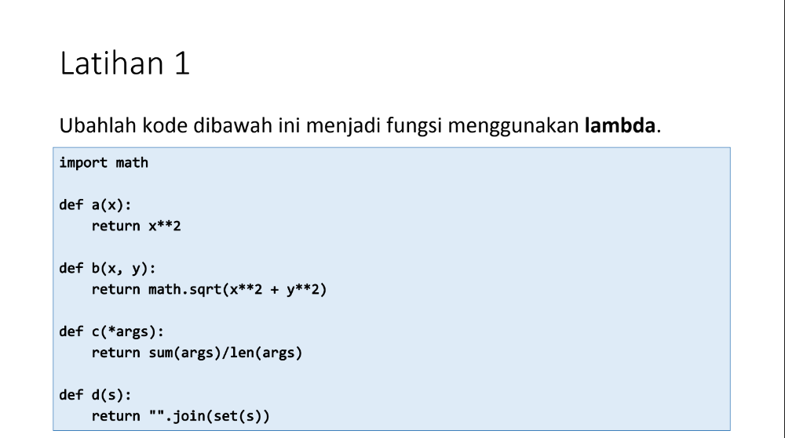

Nama : Alif Nur Fathlii Amarta

NIM : 312210326

Kelas : TI.22.A3

# Praktikum 7 

## Latihan 



- Kode program menggunakan Lambda
```
import math

a = lambda x: x ** 2
print(a(46))

b = lambda x,y: x**2 + y**2
print(b(4,6))

c = lambda *args : sum(args)/len(args)
print(c(5,7,9,11,10))

d = lambda s: "".join(set(s))
print(d("Tertimpa"))
```
Fungsi Lambda tidak perlu menggunakan ```def``` dan ```return```

- Hasilnya 


hasil dari ```"".join(set(s))"``` akan menghasilkan huruf random 


---

## Tugas

