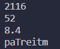
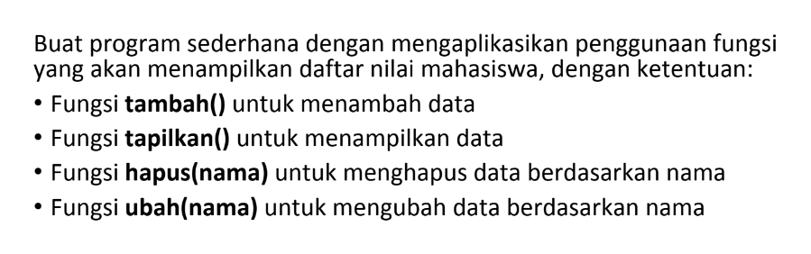
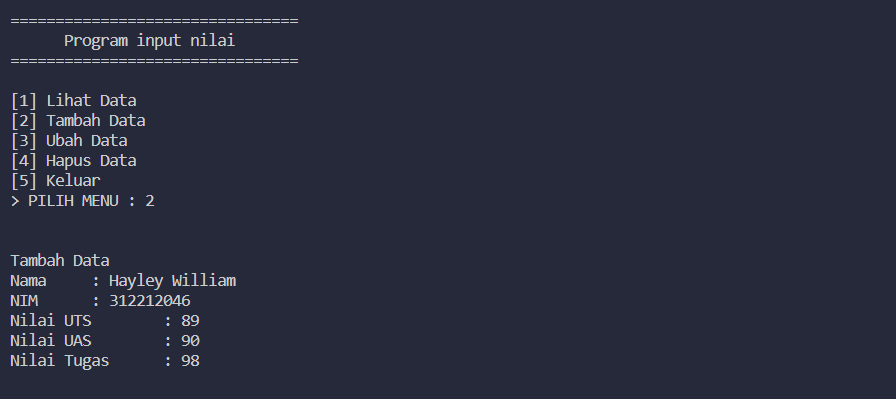
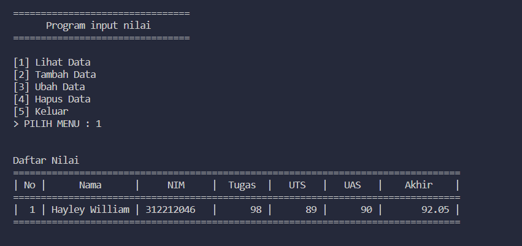
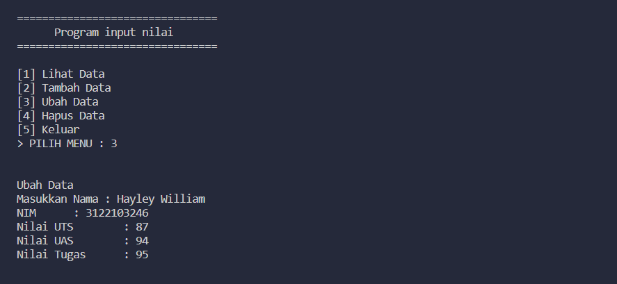
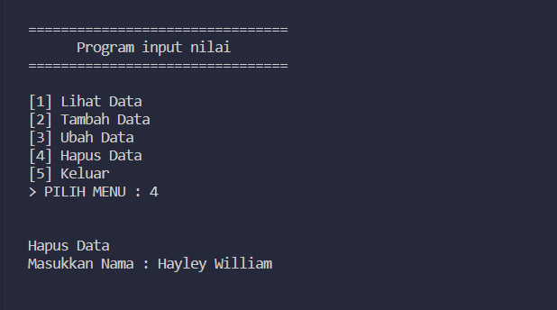
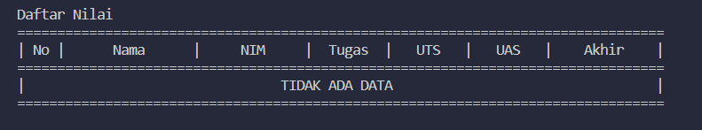
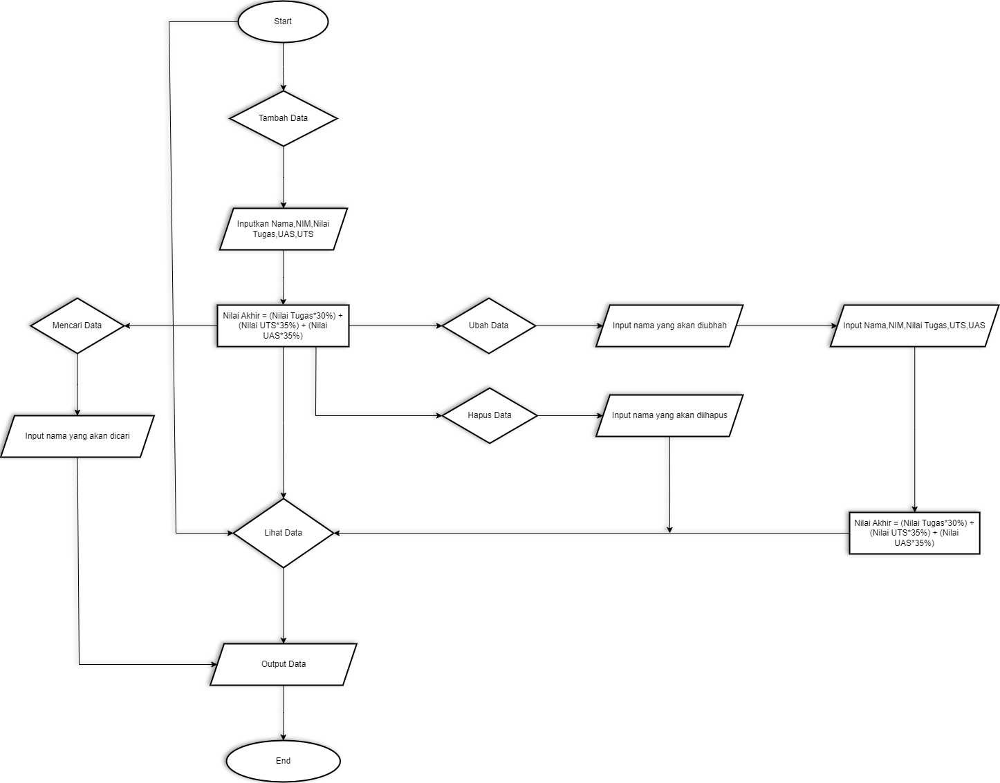

Nama : Alif Nur Fathlii Amarta

NIM : 312210326

Kelas : TI.22.A3

# Praktikum 7 

## Latihan 


- Kode program menggunakan Lambda
```
import math

a = lambda x: x ** 2
print(a(46))

b = lambda x,y: x**2 + y**2
print(b(4,6))

c = lambda *args : sum(args)/len(args)
print(c(5,7,9,11,10))

d = lambda s: "".join(set(s))
print(d("Tertimpa"))
```
Fungsi Lambda tidak perlu menggunakan ```def``` dan ```return```

- Hasilnya 



hasil dari ```"".join(set(s))"``` akan menghasilkan huruf random 


---

## Tugas



- Buat Dictionary bernama mahasiswa

``` 
mahasiswa = {}
```

- Buat code untuk Tambah Data dan Ubah Data

```
from menu.mahasiswa import mahasiswa

def add():
    print("Tambah Data")
    nama = input("Nama\t : ")
    nim = input("NIM\t : ")
    uts = int(input("Nilai UTS\t : "))
    uas = int(input("Nilai UAS\t : "))
    tugas = int(input("Nilai Tugas\t : "))
    akhir = (tugas * 30/100) + (uts * 35/100) + (uas * 35/100)
    mahasiswa[nama] = nim, tugas, uts, uas, akhir

def update():
    print("Ubah Data")
    nama = input("Masukkan Nama : ")
    if nama in mahasiswa.keys():
        nim = input("NIM\t : ")
        uts = int(input("Nilai UTS\t : "))
        uas = int(input("Nilai UAS\t : "))
        tugas = int(input("Nilai Tugas\t : "))
        akhir = (tugas * 30/100) + (uts * 35/100) + (uas * 35/100)
        mahasiswa[nama] = nim, tugas, uts, uas, akhir

    else:
        print("Nama tidak ditemukan ")
```

- Buat code untuk menu Lihat Data

``` 
from menu.mahasiswa import mahasiswa

def show():
    if mahasiswa.items():
        print("Daftar Nilai")
        print("=================================================================================")
        print("| No |      Nama      |     NIM     |  Tugas  |   UTS   |   UAS   |    Akhir    |")
        print("=================================================================================")
        i = 0
        for a in mahasiswa.items():
            i += 1
            print("| {no:2d} | {0:14s} | {1:11s} | {2:7d} | {3:7d} | {4:7d} |      {5:6.2f} |"
            .format (a[0][: 14],a[1][0],a[1][1],a[1][2],a[1][3],a[1][4], no = i))
        print("=================================================================================")
        
    else:
        print("Daftar Nilai")
        print("=================================================================================")
        print("| No |      Nama      |     NIM     |  Tugas  |   UTS   |   UAS   |    Akhir    |")
        print("=================================================================================")
        print("|                                TIDAK ADA DATA                                 |")
        print("=================================================================================")
```

- Buat code untuk menu Hapus Data

```
from menu.mahasiswa import mahasiswa

def delete():
    print("Hapus Data")
    nama = input("Masukkan Nama : ")
    
    if nama in mahasiswa.keys():
        del mahasiswa[nama]
    
    else:
        print("Nama tidak ditemukan")
```

- Buat code untuk main nya agar berjalan

```
from menu.add import add,update
from menu.view import show
from menu.delete import delete

while True:

    print("\n")
    print("================================")
    print("      Program input nilai       ")
    print("================================\n")

    print("[1] Lihat Data")
    print("[2] Tambah Data")
    print("[3] Ubah Data")
    print("[4] Hapus Data")
    print("[5] Keluar")

    x = input("> PILIH MENU : ")

    print("\n")

    if x == '1':
        show()
    elif x == '2':
        add()
    elif x == '3':
        update()
    elif x == '4':
        delete()

    elif x == '5':
        print("==========================================================================")
        print('\n')
        print("> You exit the code                        ")
        print("> Thanks for using it :DDD ")
        print("\n")
        print("==========================================================================")

        exit()

    else:
        print("            KODE YANG ANDA MASUKKAN TIDAK VALID !!!!!!!!!!!")
```

### Hasil Output

- Output Tambah Data



- Output Lihat Data



- Output Ubah Data



jika dilihat akan terubah


- Output Hapus Data



jika dilihat akan terhapus



### Flowchart

